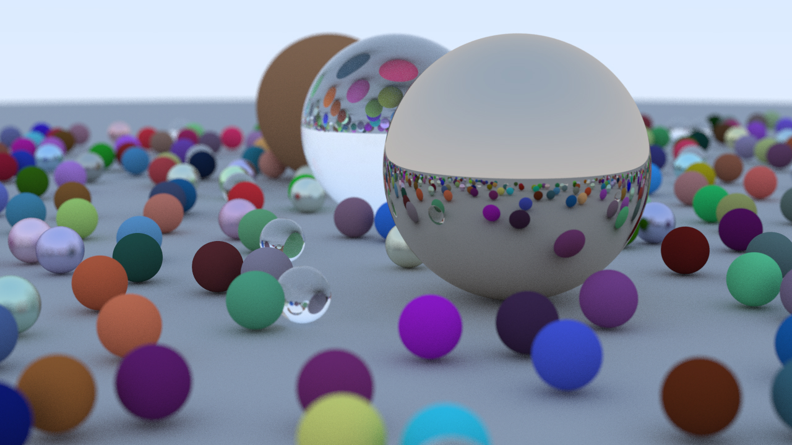

# Ray Tracing

Building a path tracing running on CPU, using C++. This project is being developed following the guidelines of the [_Ray Tracing Series_](https://raytracing.github.io) books.

## 1st Book, [_Ray Tracing in One Weekend_](https://raytracing.github.io/books/RayTracingInOneWeekend.html)

Covered:
- Antialiasing;
- Gamma Correction;
- Materials;
- Reflection;
- Refraction; and
- Defocus Blur.

Extra:
- Multithreaded rendering.

 

<em>Image generated with 150 samples per pixel and a maximum depth of 50.</em>

